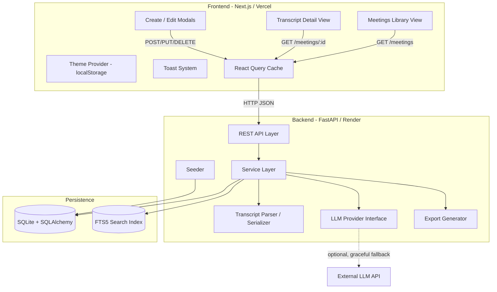
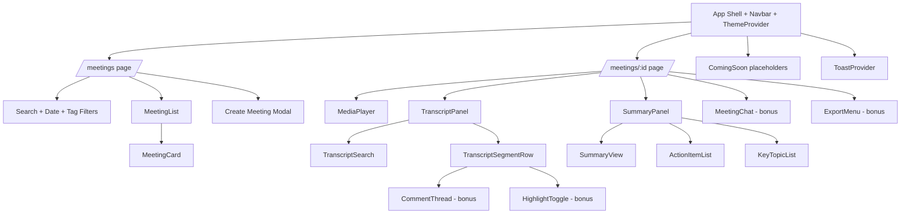
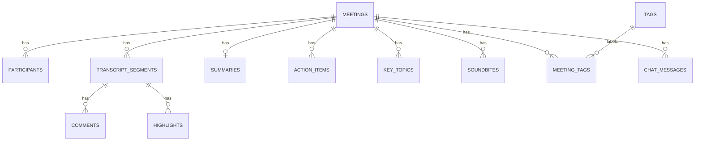

# Design Document

## Overview

This document describes the technical design for a Fireflies.ai meeting-assistant clone. The system lets a single `Default_User` browse a library of past meetings, view interactive transcripts synchronized with a media player, read AI summaries / action items / key topics, create meetings by uploading or pasting transcripts, and manage meeting data. It also covers the bonus capabilities: comments / highlights / soundbites, export, global search, tags, ask-a-question chat, and dark mode.

The product is split into three deployable concerns:

- **Frontend** — a Next.js (TypeScript, App Router) application deployed to Vercel. It owns all UI, client-side filtering/search highlighting, media-player synchronization, theme persistence, and toast notifications.
- **Backend** — a Python FastAPI service deployed to Render/Railway. It owns persistence, transcript parsing/serialization, validation, seeding, export generation, and the LLM integration boundary.
- **Database** — a SQLite file managed by the backend through SQLAlchemy. The schema is the canonical source of truth for meetings and all related entities and is designed to survive restarts (Requirement 8).

Key scoping decisions driven by the requirements:

- Real speech-to-text is out of scope. Transcripts are seeded, uploaded (`.txt`/`.vtt`/`.json`), or pasted, then normalized into `Transcript_Segments` (Requirements 4, 7).
- Summaries, action items, and key topics may be seeded, mocked, or LLM-generated. The LLM is hidden behind a mockable interface that degrades gracefully when no API key is configured (Requirement 3).
- There is no authentication. All data belongs to one implicit `Default_User` (Requirement 10).

### Technology Choices and Rationale

| Concern | Choice | Rationale |
|---|---|---|
| Frontend framework | Next.js 14+ (App Router, TypeScript) | Required by the assignment; App Router gives route-based code-splitting for the library vs. detail views (Requirements 1, 2, 9). |
| Data fetching/cache | TanStack Query (React Query) | Built-in loading/error/retry states map directly to Requirements 1.7, 1.8, 13.5, 13.6. |
| Backend framework | FastAPI (Python) | Preferred option; Pydantic gives declarative validation that maps to field-level error reporting (Requirements 4.2, 5.2, 6.2). |
| ORM | SQLAlchemy 2.x + Alembic | Clean schema modeling, cascade deletes (Requirement 5.4), and migrations. |
| Database | SQLite | Required; zero-config, file-backed persistence across restarts (Requirement 8). |
| Search (bonus) | SQLite FTS5 (with `LIKE` fallback) | Fast case-insensitive partial match across titles/summaries/segments (Requirement 13). |
| PDF export (bonus) | WeasyPrint or ReportLab | Server-side PDF generation (Requirement 12). |
| Property testing | Hypothesis (Python) | Drives the transcript round-trip property (Requirement 7.5). |
| LLM SDK | google-genai (new SDK, supports AQ. key format) + gemini-2.5-flash model | Replaces deprecated google-generativeai; AQ. key format requires the new SDK. |

## Architecture

### High-Level Architecture



### Request Flow Examples

**Opening the library (Requirement 1):** The library view issues `GET /api/meetings`. React Query renders a loading indicator while in flight (1.7), an error state with a retry control on failure (1.8), and otherwise the meeting list. Default sort (date desc, then title asc) is applied by the backend (1.2); search and date/tag filtering are applied client-side over the cached list for sub-second responsiveness (1.3, 1.4, 14.4).

**Opening a meeting (Requirement 2):** The detail view issues `GET /api/meetings/:id` which returns the meeting, ordered segments, summary, action items, key topics, and (bonus) comments/highlights/soundbites/tags in one payload. The frontend renders the transcript and summary as two independently scrollable panels (9.2) and wires the media player to the segment timeline for click-to-seek (2.5) and active-segment highlighting (2.6).

**Creating a meeting from a file (Requirements 4, 7):** The create modal POSTs metadata plus an uploaded file or pasted text. The backend validates metadata, dispatches the raw content to the format-specific parser, normalizes into segments, and persists meeting + segments in a single transaction. Any parse failure aborts the transaction so no partial meeting is created (4.5, 7.2, 7.3).

### Layering

The backend uses a three-layer structure to keep transport, business logic, and persistence separate (supports maintainability and isolated testing):

- **API layer** (`routers/`): FastAPI routers, request/response Pydantic schemas, HTTP status mapping.
- **Service layer** (`services/`): business rules, validation orchestration, transactions, parser/LLM/export coordination.
- **Persistence layer** (`models/`, `repositories/`): SQLAlchemy models and query helpers.

The parser/serializer and the LLM provider are pure-logic modules with no transport dependencies, which is what makes the round-trip property and provider mocking straightforward to test.

## Components and Interfaces

### Frontend Components



| Component | Responsibility | Requirements |
|---|---|---|
| `AppShell` / `Navbar` | Global layout, profile/settings placeholders, theme toggle | 1.9, 9.1, 16.1 |
| `MeetingList` / `MeetingCard` | Render title, date, duration, participants, tags; empty/loading/error states | 1.1, 1.6, 1.7, 1.8, 14.5 |
| `SearchAndFilters` | Debounced search, date-range filter, tag filter (AND semantics) | 1.3, 1.4, 14.4, 14.6 |
| `MediaPlayer` | Placeholder/sample media with seek bar; emits `currentTime`; accepts seek commands | 2.3, 2.4, 2.5 |
| `TranscriptPanel` / `TranscriptSegmentRow` | Ordered segments (HH:MM:SS), click-to-seek, active-segment highlight, search highlight | 2.1, 2.5, 2.6, 2.7, 2.9 |
| `SummaryPanel` | Summary, action items (CRUD + complete), key topics, placeholders | 3.1-3.3, 3.5, 3.6, 6.* |
| `CreateMeetingModal` / `EditMeetingModal` | Forms with validation, file upload, paste, pre-population | 4.*, 5.*, 9.5 |
| `ToastProvider` | Success/failure toasts with 3-5s auto-dismiss | 4.6, 5.7, 5.8, 9.3, 9.4 |
| `ThemeProvider` | Light/dark theme, persisted to `localStorage` | 16.* |
| `GlobalSearch` (bonus) | Cross-meeting search with excerpts | 13.* |
| `MeetingChat` (bonus) | Ask-a-question chat with loading + error states | 15.* |
| `ExportMenu` (bonus) | Trigger export + download | 12.* |
| `ComingSoon` | Non-interactive labeled placeholders | 9.6, 10.1-10.4 |

**Client-side synchronization (Requirement 2.6):** Segments are kept in an array sorted by `start_time`. On each media `timeupdate`, a binary search finds the segment whose `[start_time, end_time)` range contains the current position and marks exactly one segment active. When `end_time` is null, the implied end is the next segment's `start_time` (or media end for the last segment). This keeps highlight updates well under the 500 ms budget.

### Backend Components / Interfaces

```python
# Parser interface (Requirement 7)
class TranscriptParser(Protocol):
    extension: str  # ".txt" | ".vtt" | ".json"
    def parse(self, raw: str) -> list[TranscriptSegment]: ...      # raises TranscriptParseError(reason, location)

def serialize_segments(segments: list[TranscriptSegment]) -> str:  # normalized JSON (Requirement 7.4)
    ...

# LLM provider interface (Requirement 3) - mockable, graceful degradation
class SummaryProvider(Protocol):
    def is_available(self) -> bool: ...
    def generate(self, transcript_text: str) -> GenerationResult:  # summary + action items + key topics
        ...

class MockSummaryProvider:   # deterministic, always available; default when no API key
    ...
class GeminiSummaryProvider: # used only when GEMINI_API_KEY is configured, uses google-genai SDK with gemini-2.5-flash
    ...

# Export interface (Requirement 12)
class Exporter(Protocol):
    fmt: str  # "pdf" | "md" | "txt"
    def render(self, meeting: Meeting, content_kind: str) -> bytes: ...
```

The service layer selects a parser by file extension / declared format, a `SummaryProvider` by configuration (mock when `GEMINI_API_KEY` is absent), and an `Exporter` by requested format, rejecting unsupported formats (12.5).

## Data Models

### Entity-Relationship Overview



### SQLite Schema

The schema uses `INTEGER` epoch-second timestamps for portability, enforces `FOREIGN KEY` constraints (`PRAGMA foreign_keys = ON`), and uses `ON DELETE CASCADE` so deleting a meeting removes all dependent rows in one operation (Requirement 5.4). Rationale notes follow each table.

```sql
-- Core meeting record (Requirements 1, 4, 5, 8)
CREATE TABLE meetings (
    id              INTEGER PRIMARY KEY AUTOINCREMENT,
    title           TEXT    NOT NULL CHECK (length(title) BETWEEN 1 AND 200),
    meeting_date    TEXT    NOT NULL,             -- ISO 8601 date (YYYY-MM-DD)
    duration_seconds INTEGER NOT NULL DEFAULT 0 CHECK (duration_seconds >= 0),
    media_url       TEXT,                          -- placeholder/sample media; nullable
    created_at      INTEGER NOT NULL,
    updated_at      INTEGER NOT NULL
);
CREATE INDEX idx_meetings_date_title ON meetings (meeting_date DESC, title ASC);
-- Rationale: composite index backs the default sort (1.2) directly.

-- Participants (Requirement 1.1, 4.1, 5.1) - separate table allows 0..N names and search by participant
CREATE TABLE participants (
    id          INTEGER PRIMARY KEY AUTOINCREMENT,
    meeting_id  INTEGER NOT NULL REFERENCES meetings(id) ON DELETE CASCADE,
    name        TEXT    NOT NULL CHECK (length(name) BETWEEN 1 AND 200),
    position    INTEGER NOT NULL DEFAULT 0          -- preserves display order
);
CREATE INDEX idx_participants_meeting ON participants (meeting_id);
-- Rationale: normalized rather than a delimited string so participant-name search (1.3) is clean.

-- Transcript segments (Requirements 2, 7) - the normalized transcript representation
CREATE TABLE transcript_segments (
    id            INTEGER PRIMARY KEY AUTOINCREMENT,
    meeting_id    INTEGER NOT NULL REFERENCES meetings(id) ON DELETE CASCADE,
    segment_index INTEGER NOT NULL,                -- 0-based source order (7.1, 7.5)
    speaker_label TEXT    NOT NULL CHECK (length(speaker_label) >= 1),
    start_time    REAL    NOT NULL CHECK (start_time >= 0),  -- seconds offset
    end_time      REAL    CHECK (end_time IS NULL OR end_time >= start_time),
    text          TEXT    NOT NULL,
    UNIQUE (meeting_id, segment_index)
);
CREATE INDEX idx_segments_meeting_order ON transcript_segments (meeting_id, segment_index);
CREATE INDEX idx_segments_meeting_time  ON transcript_segments (meeting_id, start_time);
-- Rationale: segment_index preserves exact source ordering required by the round-trip property (7.5);
-- start_time index backs active-segment lookup (2.6); UNIQUE prevents duplicate ordering.

-- One summary per meeting (Requirement 3)
CREATE TABLE summaries (
    id                INTEGER PRIMARY KEY AUTOINCREMENT,
    meeting_id        INTEGER NOT NULL UNIQUE REFERENCES meetings(id) ON DELETE CASCADE,
    summary_text      TEXT,                         -- nullable => "no summary" placeholder (3.5)
    generation_status TEXT NOT NULL DEFAULT 'none'  -- 'none'|'seeded'|'generated'|'failed' (3.4, 3.7)
                       CHECK (generation_status IN ('none','seeded','generated','failed')),
    generation_error  TEXT,                         -- recorded when status='failed' (3.7)
    created_at        INTEGER NOT NULL,
    updated_at        INTEGER NOT NULL
);
-- Rationale: UNIQUE meeting_id enforces the one-to-one relationship; status/error columns capture
-- graceful-degradation outcomes without mutating prior data (3.7).

-- Action items (Requirement 6)
CREATE TABLE action_items (
    id          INTEGER PRIMARY KEY AUTOINCREMENT,
    meeting_id  INTEGER NOT NULL REFERENCES meetings(id) ON DELETE CASCADE,
    description TEXT    NOT NULL CHECK (length(trim(description)) BETWEEN 1 AND 500),
    is_complete INTEGER NOT NULL DEFAULT 0 CHECK (is_complete IN (0,1)),
    created_at  INTEGER NOT NULL,
    updated_at  INTEGER NOT NULL
);
CREATE INDEX idx_action_items_meeting ON action_items (meeting_id, created_at);
-- Rationale: created_at index backs the oldest-to-newest ordering requirement (6.7).

-- Key topics / chapters (Requirement 3.3)
CREATE TABLE key_topics (
    id          INTEGER PRIMARY KEY AUTOINCREMENT,
    meeting_id  INTEGER NOT NULL REFERENCES meetings(id) ON DELETE CASCADE,
    topic       TEXT    NOT NULL CHECK (length(topic) >= 1),
    position    INTEGER NOT NULL DEFAULT 0
);
CREATE INDEX idx_key_topics_meeting ON key_topics (meeting_id, position);

-- Comments on segments (Requirement 11, bonus)
CREATE TABLE comments (
    id          INTEGER PRIMARY KEY AUTOINCREMENT,
    segment_id  INTEGER NOT NULL REFERENCES transcript_segments(id) ON DELETE CASCADE,
    body        TEXT    NOT NULL CHECK (length(trim(body)) BETWEEN 1 AND 1000),
    created_at  INTEGER NOT NULL,
    updated_at  INTEGER NOT NULL
);
CREATE INDEX idx_comments_segment ON comments (segment_id);

-- Highlights on segments (Requirement 11, bonus)
CREATE TABLE highlights (
    id          INTEGER PRIMARY KEY AUTOINCREMENT,
    segment_id  INTEGER NOT NULL REFERENCES transcript_segments(id) ON DELETE CASCADE,
    color       TEXT    NOT NULL DEFAULT 'yellow',
    created_at  INTEGER NOT NULL,
    UNIQUE (segment_id)                              -- at most one highlight per segment
);

-- Soundbites spanning a time range within a meeting (Requirement 11, bonus)
CREATE TABLE soundbites (
    id          INTEGER PRIMARY KEY AUTOINCREMENT,
    meeting_id  INTEGER NOT NULL REFERENCES meetings(id) ON DELETE CASCADE,
    label       TEXT,
    start_time  REAL    NOT NULL CHECK (start_time >= 0),
    end_time    REAL    NOT NULL,
    created_at  INTEGER NOT NULL,
    CHECK (end_time >= start_time)                   -- enforces valid range (11.6)
);
CREATE INDEX idx_soundbites_meeting ON soundbites (meeting_id);

-- Tags and the meeting/tag join (Requirement 14, bonus)
CREATE TABLE tags (
    id   INTEGER PRIMARY KEY AUTOINCREMENT,
    name TEXT NOT NULL UNIQUE COLLATE NOCASE CHECK (length(trim(name)) BETWEEN 1 AND 50)
);
CREATE TABLE meeting_tags (
    meeting_id INTEGER NOT NULL REFERENCES meetings(id) ON DELETE CASCADE,
    tag_id     INTEGER NOT NULL REFERENCES tags(id)     ON DELETE CASCADE,
    PRIMARY KEY (meeting_id, tag_id)                 -- prevents duplicate tag on a meeting (14.2)
);
-- Rationale: many-to-many; COLLATE NOCASE makes tag names case-insensitively unique.

-- Chat history for ask-a-question (Requirement 15, bonus)
CREATE TABLE chat_messages (
    id          INTEGER PRIMARY KEY AUTOINCREMENT,
    meeting_id  INTEGER NOT NULL REFERENCES meetings(id) ON DELETE CASCADE,
    role        TEXT    NOT NULL CHECK (role IN ('user','assistant')),
    content     TEXT    NOT NULL,
    created_at  INTEGER NOT NULL
);
CREATE INDEX idx_chat_meeting ON chat_messages (meeting_id, created_at);

-- Full-text search index for global search (Requirement 13, bonus)
CREATE VIRTUAL TABLE meeting_search USING fts5 (
    meeting_id UNINDEXED,
    title,
    summary_text,
    transcript_text
);
-- Rationale: FTS5 gives fast case-insensitive partial matching across title/summary/transcript;
-- a LIKE-based query is the fallback if FTS5 is unavailable in the deployment's SQLite build.
```

### Normalized Transcript JSON (Requirement 7.4)

The canonical serialized form is a JSON object whose `segments` array preserves order and carries exactly the fields that define segment equivalence:

```json
{
  "version": 1,
  "segments": [
    { "index": 0, "speaker": "Alice", "start": 0.0, "end": 4.2, "text": "Welcome everyone." },
    { "index": 1, "speaker": "Bob",   "start": 4.2, "end": null, "text": "Thanks for joining." }
  ]
}
```

Two segment collections are **equivalent** when they have identical length and, for every index, identical `speaker`, `start`, `end`, and `text`. This equivalence definition is the contract tested by the round-trip property (Requirement 7.5).

### API-Level DTOs

Response DTOs are flat projections of these tables (e.g. `MeetingSummaryDTO` for list rows, `MeetingDetailDTO` bundling segments + summary + action items + topics + bonus entities). Request DTOs are Pydantic models that enforce the field-level constraints from Requirements 4, 5, 6, 11, and 14 before the service layer runs.

## REST API Design

Base path `/api`. All responses are JSON except export downloads. Errors use a consistent envelope `{ "error": { "code": ..., "message": ..., "field": ... } }` so the frontend can show field-level and toast messages.

| Method | Path | Purpose | Requirements |
|---|---|---|---|
| GET | `/meetings` | List meetings (default sort applied), supports `?search=&from=&to=&tags=` | 1.1, 1.2, 14.4 |
| POST | `/meetings` | Create meeting (metadata + optional pasted transcript) | 4.1, 4.2, 4.4 |
| POST | `/meetings/upload` | Create meeting with uploaded transcript file (multipart) | 4.3, 4.5, 7.* |
| GET | `/meetings/{id}` | Full detail bundle | 2.*, 3.*, 6.7, 11.7, 14.5 |
| PUT | `/meetings/{id}` | Edit metadata (title, participants) | 5.1, 5.2, 5.3 |
| DELETE | `/meetings/{id}` | Delete meeting + cascade | 5.4, 5.5 |
| POST | `/meetings/{id}/summary:generate` | Trigger LLM/mock generation | 3.4, 3.7 |
| GET | `/meetings/{id}/transcript.json` | Serialized normalized transcript | 7.4 |
| POST | `/meetings/{id}/action-items` | Add action item | 6.1, 6.2 |
| PUT | `/action-items/{id}` | Edit description / toggle complete | 6.2, 6.4, 6.5, 6.6 |
| DELETE | `/action-items/{id}` | Remove action item | 6.* |
| POST | `/segments/{id}/comments` | Add comment (bonus) | 11.1, 11.2 |
| POST | `/segments/{id}/highlight` / DELETE | Add/remove highlight (bonus) | 11.3, 11.4 |
| POST | `/meetings/{id}/soundbites` | Create soundbite (bonus) | 11.5, 11.6 |
| GET | `/meetings/{id}/export?kind=transcript|summary&format=pdf|md|txt` | Export (bonus) | 12.* |
| GET | `/search?q=` | Global search with excerpts (bonus) | 13.* |
| POST | `/meetings/{id}/tags` / DELETE | Add/remove tag (bonus) | 14.1-14.3 |
| POST | `/meetings/{id}/chat` | Ask a question (bonus) | 15.* |

HTTP status mapping: `201` create, `200` read/update, `204` delete, `400` validation (with `field`), `404` not found (5.3), `415` unsupported export format (12.5), `422` unparseable transcript (7.2/7.3), `500`/`503` persistence or provider failure (8.2, 3.7).

## Correctness Properties

*A property is a characteristic or behavior that should hold true across all valid executions of a system — essentially, a formal statement about what the system should do. Properties serve as the bridge between human-readable specifications and machine-verifiable correctness guarantees.*

The properties below are derived from the prework classification. UI-presence, timing, navigation, infrastructure-durability, and setup criteria were classified as EXAMPLE / INTEGRATION / SMOKE and are covered by the Testing Strategy rather than as properties. Redundant criteria were consolidated (e.g. parser serialize-fidelity folds into the round-trip; highlight and tag add/remove are single round-trip properties).

### Property 1: Transcript parse/serialize round-trip

*For any* valid collection of `Transcript_Segments`, parsing the normalized JSON produced by serializing that collection yields a collection that is equivalent to the original — identical segment count, identical ordering, and identical `speaker_label`, `start_time`, `end_time`, and `text` for every segment.

**Validates: Requirements 7.4, 7.5**

### Property 2: Parser produces ordered, well-formed segments

*For any* valid `.txt`, `.vtt`, or `.json` transcript input, the parser produces segments in source order (`segment_index` strictly increasing from 0), and every produced segment has a non-empty `speaker_label`, a `start_time >= 0`, and `text`.

**Validates: Requirements 7.1**

### Property 3: Invalid transcript input is rejected atomically

*For any* transcript input that is nonconforming to its declared format, exceeds the size limit, or yields zero parseable segments, the backend rejects it with an error indicating the reason (and location where applicable) and persists no meeting and no `Transcript_Segment`.

**Validates: Requirements 4.5, 7.2, 7.3**

### Property 4: Default library ordering

*For any* set of meetings, the default-sorted library lists them by `meeting_date` descending, and for meetings sharing a date, by `title` ascending.

**Validates: Requirements 1.2**

### Property 5: Library search membership

*For any* set of meetings and any search text, the filtered result contains exactly those meetings whose `title` or any participant name contains the search text under case-insensitive partial matching.

**Validates: Requirements 1.3**

### Property 6: Combined date-and-search filtering

*For any* set of meetings, date-filter range, and search text, the result equals the intersection of the meetings satisfying the date range and the meetings satisfying the search predicate.

**Validates: Requirements 1.4**

### Property 7: Transcript display ordering and timestamp formatting

*For any* meeting transcript, the detail view renders segments in ascending `start_time` order, and *for any* non-negative timestamp the rendered label equals its correct `HH:MM:SS` representation.

**Validates: Requirements 2.1**

### Property 8: Click-to-seek mapping

*For any* selected `Transcript_Segment`, the media player's playback position is set to that segment's `start_time`.

**Validates: Requirements 2.5**

### Property 9: Exactly one active segment

*For any* time-ordered segment collection and any playback position within the media duration, the active-segment lookup returns exactly the unique segment whose `[start_time, end_time)` range (with end implied by the next segment's start when null) contains the position, and at most one segment is active at a time.

**Validates: Requirements 2.6**

### Property 10: Transcript search highlights exactly the matches

*For any* transcript text and any search query of 1–200 characters, the set of highlighted ranges equals the set of all case-insensitive occurrences of the query in the displayed segments.

**Validates: Requirements 2.7**

### Property 11: Failed generation preserves existing data

*For any* pre-existing meeting state, when summary/action-item/key-topic generation fails, the meeting's existing data is unchanged and the summary's `generation_status` is recorded as `failed` with an error indication.

**Validates: Requirements 3.7**

### Property 12: Meeting create persistence round-trip

*For any* valid create-meeting metadata (title 1–200 chars, valid date, 0–100 participants), creating then retrieving the meeting returns a record whose title, date, and participants equal the submitted values.

**Validates: Requirements 4.1**

### Property 13: Invalid meeting create rejected with field error

*For any* create-meeting metadata violating a field constraint (missing/oversized title, absent/invalid date, or more than 100 participants), the backend rejects the submission, creates no meeting record, and returns an error identifying the failing field.

**Validates: Requirements 4.2**

### Property 14: Meeting edit persistence round-trip

*For any* existing meeting and any valid edit (title 1–200 chars, 0–50 participants), applying the edit then retrieving the meeting returns the updated title and participants.

**Validates: Requirements 5.1**

### Property 15: Invalid meeting edit rejected, record unchanged

*For any* edit metadata with an empty/oversized title or more than 50 participants, the backend rejects the update, leaves the existing record unchanged, and returns a validation error.

**Validates: Requirements 5.2**

### Property 16: Delete cascade completeness

*For any* meeting with associated participants, segments, summary, action items, key topics, and bonus annotations, confirming deletion removes the meeting and leaves no orphaned dependent rows referencing it in any child table.

**Validates: Requirements 5.4**

### Property 17: Action item persistence and validation round-trip

*For any* action-item description of 1–500 characters, adding or editing it persists the value (new items default to incomplete) and it is retrievable; *for any* description that is empty, only whitespace, or exceeds 500 characters, the operation is rejected and the database is unchanged.

**Validates: Requirements 6.1, 6.2, 6.4**

### Property 18: Completion-status toggle round-trip

*For any* action item, marking it complete sets its status to complete, and subsequently marking it incomplete restores it to incomplete.

**Validates: Requirements 6.5, 6.6**

### Property 19: Action items ordered oldest-to-newest

*For any* set of action items belonging to a meeting, the displayed list is ordered by creation time from oldest to newest.

**Validates: Requirements 6.7**

### Property 20: Write-path failure safety

*For any* create or update of a meeting, transcript, summary, or action item, if persistence fails the backend returns an error and does not report the operation as successful, leaving prior persisted state unchanged.

**Validates: Requirements 8.2**

### Property 21: Comment validation round-trip (bonus)

*For any* comment text of 1–1,000 characters, creating it persists a comment associated with the target segment; *for any* comment that is empty, only whitespace, or exceeds 1,000 characters, the operation is rejected and the database is unchanged.

**Validates: Requirements 11.1, 11.2**

### Property 22: Highlight add/remove round-trip (bonus)

*For any* `Transcript_Segment`, applying a highlight and then removing it returns the segment's highlight state to its original (absent) state.

**Validates: Requirements 11.3, 11.4**

### Property 23: Soundbite range validity (bonus)

*For any* soundbite request, the operation succeeds and persists the stored start/end timestamps when the end is greater than or equal to the start and both endpoints belong to the same meeting, and is rejected with the database unchanged when the end precedes the start or the endpoints belong to different meetings.

**Validates: Requirements 11.5, 11.6**

### Property 24: Export content completeness (bonus)

*For any* meeting, a generated Markdown or TXT export of its transcript or summary contains the meeting title, the meeting date, every participant name, and the selected transcript or summary content.

**Validates: Requirements 12.3**

### Property 25: Global search membership and excerpt (bonus)

*For any* set of meetings and any query of 1–200 characters, global search returns exactly the meetings whose title, summary, or any transcript segment contains the query under case-insensitive partial matching, and each returned result's excerpt contains the matched text.

**Validates: Requirements 13.1, 13.2**

### Property 26: Tag association add/remove round-trip and validation (bonus)

*For any* tag of 1–50 characters, adding it to a meeting associates it (and adding then removing it returns the meeting to its original tag set); *for any* tag that is empty, only whitespace, exceeds 50 characters, or duplicates an existing tag on the same meeting, the operation is rejected and the database is unchanged.

**Validates: Requirements 14.1, 14.2, 14.3**

### Property 27: Tag AND-filtering (bonus)

*For any* set of meetings and any selection of tags, the filtered library result equals exactly the meetings whose associated tag set includes all selected tags.

**Validates: Requirements 14.4**

### Property 28: Question validation gating (bonus)

*For any* question text that is empty, only whitespace, or exceeds 1,000 characters, the frontend rejects the submission, signals that the text is invalid, and does not invoke the backend.

**Validates: Requirements 15.4**

## Error Handling

### Error Envelope

All backend errors return a consistent JSON envelope so the frontend can render field-level messages and toasts uniformly:

```json
{ "error": { "code": "VALIDATION_ERROR", "message": "Title must be 1-200 characters", "field": "title" } }
```

| Condition | Status | `code` | Requirements |
|---|---|---|---|
| Field validation failure | 400 | `VALIDATION_ERROR` (+`field`) | 4.2, 5.2, 6.2, 11.2, 14.2 |
| Meeting not found | 404 | `NOT_FOUND` | 5.3 |
| Unparseable / nonconforming transcript | 422 | `PARSE_ERROR` (+location) | 4.5, 7.2, 7.3 |
| File too large / wrong extension | 422 | `INVALID_FILE` | 4.5, 7.3 |
| Unsupported export format | 415 | `UNSUPPORTED_FORMAT` | 12.5 |
| LLM generation failure | 200 (status=`failed`) / 503 on-demand | `GENERATION_FAILED` | 3.7, 12.6, 15.5 |
| Persistence failure | 500 | `PERSISTENCE_ERROR` | 8.2, 5.5, 6.3, 11.8, 14.7 |

### Atomicity and Safety

- **Transactional writes:** Meeting creation with transcript parsing runs in a single transaction. Any parser exception or persistence failure rolls back the whole transaction, guaranteeing no partial meeting or orphan segments (Properties 3, 20; Requirements 4.5, 7.2, 8.2).
- **Cascade integrity:** Deletes rely on `ON DELETE CASCADE` plus `PRAGMA foreign_keys = ON`. A delete failure rolls back, retaining all records (Requirement 5.5).
- **Graceful LLM degradation:** When no API key is configured the service binds `MockSummaryProvider`, which always succeeds deterministically. When a real provider is configured and errors, the service records `generation_status='failed'` and `generation_error` without mutating prior summary/action-item/topic data (Property 11; Requirement 3.7). Ask-a-question failures return an error while the frontend retains the question text (Requirement 15.5).
- **Startup safety:** If reading persisted records fails during startup, the backend surfaces an error and performs no destructive write (Requirement 8.4).

### Frontend Error and Loading States

React Query supplies `isLoading` / `isError` / `refetch` used to render loading indicators (1.7, 13.5), error states with retry controls (1.8, 13.6), and media-load error indication while preserving displayed segments (2.4). Failed mutations raise failure toasts and retain user-entered form data (5.8, 9.4); successes raise auto-dismissing toasts (4.6, 5.7, 9.3).

## Testing Strategy

### Dual Approach

The suite combines **property-based tests** (universal correctness over generated inputs) with **example-based unit tests** (specific scenarios, edge cases, error messages) and **integration / smoke tests** (persistence durability, LLM wiring, export generation, seeding). Property tests catch general logic bugs; unit tests pin concrete behavior and UI states.

### Property-Based Testing

- **Library:** Hypothesis (Python) for backend logic (parser/serializer, validation, ordering, filtering, search, cascade). For client-side pure functions (active-segment lookup, search-match highlighting, sort/filter, HH:MM:SS formatting, question validation) use `fast-check` (TypeScript).
- **Each property** from the Correctness Properties section maps to exactly one property-based test.
- **Iterations:** minimum 100 generated cases per property test.
- **Tag format** on each property test:
  `Feature: fireflies-clone, Property {number}: {property_text}`
- **Generators:**
  - *Transcript segment collections* — random speaker labels (non-empty), monotonic non-negative timestamps with optional nulls, arbitrary text including unicode/whitespace/format-significant characters (`-->`, newlines, JSON metacharacters) to stress parsers (Properties 1–3).
  - *Meeting metadata* — titles spanning valid and boundary-violating lengths, valid/invalid dates, participant lists from 0 up past the limits (Properties 12–15).
  - *Meeting sets with tags/summaries* — for ordering, filtering, search, and tag AND-filter properties (Properties 4–6, 25–27).
- **Parser emphasis:** the parse/serialize round-trip (Property 1) is the central property, with a dedicated generator per format (`.txt`, `.vtt`, `.json`) and a shared normalized-segment generator.

### Example-Based Unit Tests

Cover criteria classified EXAMPLE/EDGE_CASE: empty states (1.6, 2.2, 3.5, 3.6, 6.8, 13.4, 14.6, 15.6), navbar/layout/panels (1.9, 9.1, 9.2), forms and pre-population (9.5), Coming Soon placeholders and no-action behavior (9.6, 10.1–10.6), toast appearance/auto-dismiss windows (4.6, 5.7, 5.8, 9.3, 9.4), navigation (1.5, 13.3), not-found edit (5.3), unsupported export format (12.5), search clear (2.9), and theme toggle/persist/default (16.1–16.5). Frontend UI tests use React Testing Library; timing-bounded behaviors are asserted on observable state changes rather than wall-clock thresholds.

### Integration and Smoke Tests

- **Persistence durability (8.1, 8.3):** write records, reopen the SQLite connection, assert full retrieval equality.
- **Startup safety (8.4):** simulate a read failure, assert no destructive write occurs.
- **Seeding (8.5):** run the seeder, assert at least 3 meetings each with exactly one transcript, exactly one summary, and at least one action item.
- **LLM wiring (3.4, 15.1):** with `MockSummaryProvider`, assert generation returns summary + action items + key topics and chat returns a transcript-derived answer; verify the real provider is selected only when `GEMINI_API_KEY` is present.
- **Upload/paste persistence (4.3, 4.4):** upload one sample file per format and one pasted sample, assert segments persisted.
- **Export generation (12.1, 12.2):** export each kind/format, assert a non-empty document of the correct content type (PDF content completeness covered structurally; Markdown/TXT completeness covered by Property 24).

### Coverage Traceability

Every acceptance criterion is covered by at least one property, unit, integration, or smoke test. The Correctness Properties section is the index for property coverage; the example and integration subsections above enumerate the remainder, ensuring all 16 requirements (10 core + 6 bonus) are exercised.
